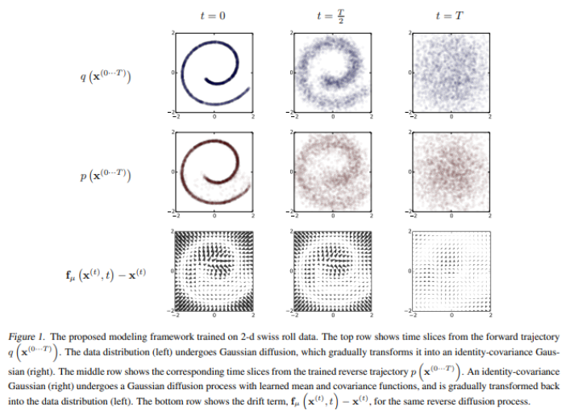

# Implementation-of-Deep-Unsupervised-Learning-using-Nonequilibrium-Thermodynamics

This project explores the fundamental concepts and implementation of diffusion models, a class of generative models that has become central to state-of-the-art image, audio, and video generation. The project is based on the Udemy course [Diffusion Models](https://www.udemy.com/course/diffusion-models/learn/lecture/37945498#overview) and a review of key [academic paper](https://arxiv.org/pdf/1503.03585) .

## The Core Concepts

### 1. The Forward Diffusion Process (Adding Noise)

This is a **Markov chain** that gradually adds Gaussian noise to an input image over a series of $T$ timesteps. The process transforms the data into a simple, known distribution, such as a Gaussian.

* **Iterative Approach:** Adds a small amount of noise at each step, computationally expensive but easy to understand.
* **Closed-Form Solution:** A computationally efficient shortcut that allows direct sampling of a noisy image at any timestep $t$ without needing to run the process for all prior steps. This is a key reason why training diffusion models is efficient.

### 2. The Reverse Diffusion Process (Denoising)

This is the generative part of the model. The goal is to learn how to gradually remove noise from a sample, starting with a random noise vector and reconstructing a coherent image.

* The process is also a Markov chain.
* A neural network is trained to predict the mean and variance of the denoised image at each step.
* The model's architecture is typically a U-Net, which is particularly effective for image-to-image tasks.

## Training & Optimization

The model is trained to minimize the difference between the learned reverse process and the true forward posterior distribution. The primary loss function used is **Kullback-Leibler (KL) divergence**.

* The training process is based on **Maximum Likelihood Estimation (MLE)**.
* The model learns to assign a high probability to real training data, effectively learning the underlying data distribution.
* The log-likelihood is used to turn products of probabilities into sums, simplifying numerical optimization.

## Project Status & To-Do

* **TODO:**
    * Develop code and visualizations for the closed-form solution of the forward diffusion process, reverse denoising process and prediction code. 
    * Implement the model architecture for the reverse diffusion process in Python.
    * Train the model on a small dataset.
    * Create a blog post to explain the difference between Probability Density Functions (PDF) and Cumulative Distribution Functions (CDF).
    